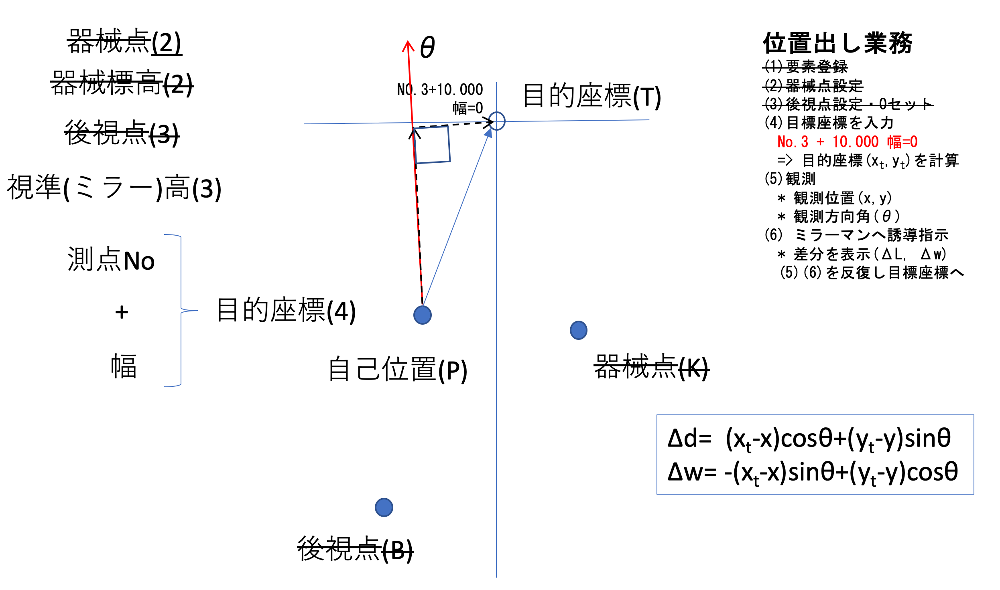
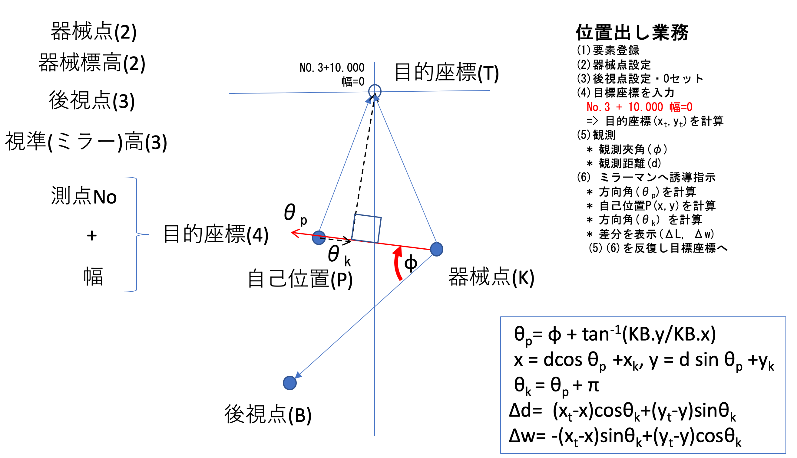

<!-- @import "[TOC]" {cmd="toc" depthFrom=1 depthTo=6 orderedList=false} -->

<!-- code_chunk_output -->

- [位置出し](#位置出し)
  - [GPS 機器での位置出し](#gps-機器での位置出し)
  - [光波での位置出し](#光波での位置出し)

<!-- /code_chunk_output -->

$$
\gdef\vectwo#1#2{\begin{pmatrix} #1 \\ #2 \end{pmatrix}}
\gdef\R#1{\begin{pmatrix} \cos#1 & -\sin#1 \\ \sin#1 & \cos#1 \end{pmatrix}}
\gdef\Rinv#1{\begin{pmatrix} \cos#1 & \sin#1 \\ -\sin#1 & \cos#1 \end{pmatrix}}
\gdef\Rinvthree#1#2#3{\begin{pmatrix} (#2)\cos#1 + (#3)\sin#1 \\ -(#2)\sin#1 + (#3)\cos#1 \end{pmatrix}}
\gdef\clothox#1{\dfrac{A}{\sqrt2} \displaystyle\int^{#1}_0 \dfrac{\cos\tau}{\sqrt{\tau}} d\tau}
\gdef\clothoy#1{\dfrac{A}{\sqrt2} \displaystyle\int^{#1}_0 \dfrac{\sin\tau}{\sqrt{\tau}} d\tau}
$$

# 位置出し

位置出しとは、路線座標上の点$P(x,y)$が与えられた時、目的座標$(x_t, y_t)$に対して、前後左右どれくらい移動すれば良いか誘導するための業務である。ここでは求める前後・左右の計算結果を$(\Delta d,\Delta w)$とする。

## GPS 機器での位置出し

下の図の通り、目的座標を点$T(x_t, y_t)$、自己位置を点$P(x, y)$とし、GPS 機器による計測結果として、自己位置$(x, y)$、方向角$\theta$がわかるものとする。すると誘導のために必要な$(\Delta d,\Delta w)$は、自己位置$(x, y)$を原点とする方向角$\theta$の座標系に変換すれば良い。

</img>

したがって、求める式は次の通りである。

$$
\vectwo{\Delta d}{\Delta w} = \Rinv{\theta}\vectwo{x_t - x}{y_t - y} = \Rinvthree{\theta}{x_t - x}{y_t - y}
$$

<!-- 
 -->

## 光波での位置出し

下の図の通り、目的座標を点$T(x_t, y_t)$、自己位置を点$P(x, y)$とし、光波による計測結果として、夾角$\phi$、距離$d$がわかるものとする。すると誘導のために必要な$(\Delta d,\Delta w)$は、自己位置$(x, y)$を原点とする自己位置$P$から器械点$K$への方向角$\theta_k$の座標系に変換すれば良い。

</img>

光波の場合、光波の据付位置を示す器械点$K(x_k, y_k)$は与えられている。夾角の基準になる後視点$B$はどこでも良いが、ここでは仮に目的座標$T$からの垂線が交わる中心線の座標$(x_b, y_b)$とする。これは路線計算で求めることができるのでここでは与えられているものとみなす。

まず、自己位置$P(x, y)$を求めるために、直線 $KP$ の方向角$\theta_p$を求める。二点$K,P$が与えられた時の方向角は 直線 $KB$ が基準であるから、計測した夾角と合わせて次の通りとなる。

$$
 \theta_p = \phi + tan^{-1}\frac{y_b - y_k}{x_b - x_k}
$$

計測された距離は$d$で、方向角がこの$\theta_p$となるから、求める自己位置$P(x, y)$は次の通りである。

$$
\vectwo{x}{y} = \R{\theta_p}\vectwo{d}{0} + \vectwo{x_k}{y_k}= \vectwo{d\cos\theta_p + x_k}{d\sin\theta_p + y_k}
$$

次に求めたい$(\Delta d,\Delta w)$を計算するには、自己位置$P$からみた器械点$K$の方向角$\theta_k$が必要である。これは$\theta_p$とちょうど向きが逆になるので、$\theta_k = \theta_p + \pi$となる。

以上により、自己位置$(x, y)$とその点の方向角$\theta_k$がわかったので、$(\Delta d,\Delta w)$は次の通りである。

$$
\vectwo{\Delta d}{\Delta w} = \Rinv{\theta_k}\vectwo{x_t - x}{y_t - y} = \Rinvthree{\theta_k}{x_t - x}{y_t - y}
$$

まとめると、光波による位置出しは、次の式で計算すればよい。

$$
\begin{aligned}
 \theta_p & = \phi + tan^{-1}\frac{y_b - y_k}{x_b - x_k} \\\\
\vectwo{x}{y} & = \vectwo{d\cos\theta_p + x_k}{d\sin\theta_p + y_k}　\\\\
\theta_k & = \theta_p + \pi \\\\
\vectwo{\Delta d}{\Delta w} & =  \Rinvthree{\theta_k}{x_t - x}{y_t - y}
\end{aligned}
$$
