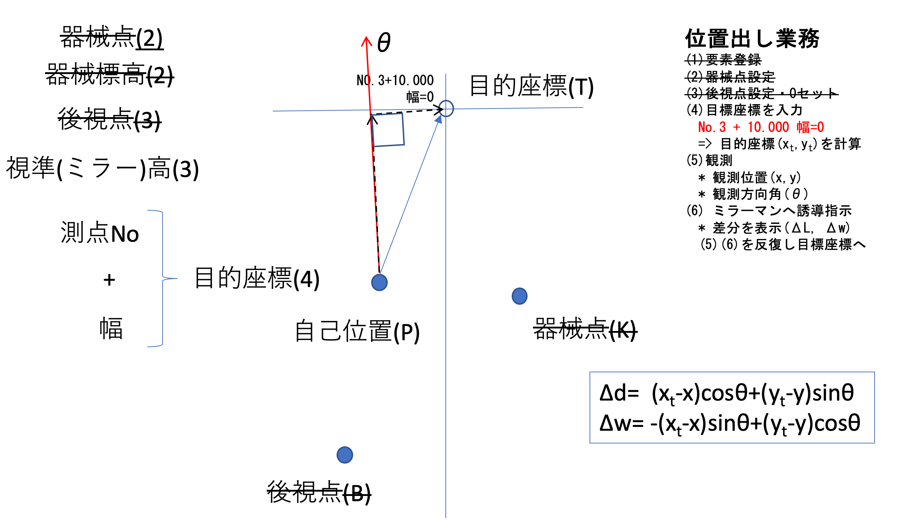
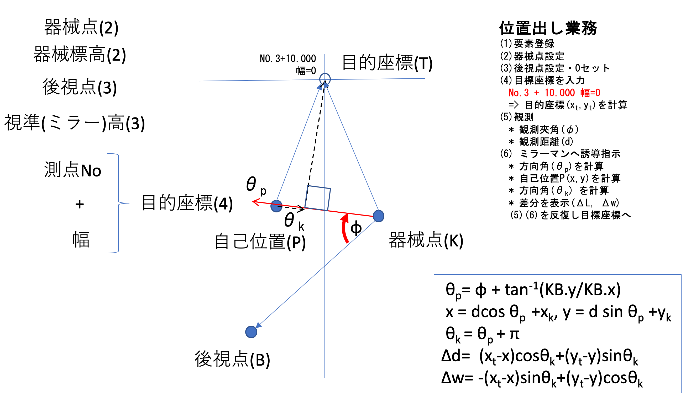

---
title: 位置出し計算
author: 秦野克彦
rights: '© 2022 合同会社Kiah'
language: ja-JP
output:
    custom_document: {path: ./ichidashi.epub}
ebook:
    authors: 秦野克彦
    title: 位置出し計算
puppeteer:
    displayHeaderFooter: true
    headerTemplate: '
, 
'
    footerTemplate: '
 /
'
---  
  
  

  
  

  
<!-- @import "[TOC]" {cmd="toc" depthFrom=1 depthTo=6 orderedList=false} -->
  
<!-- code_chunk_output -->
  
- [位置出し](#位置出し )
  - [GPS 機器での位置出し](#gps-機器での位置出し )
  - [光波での位置出し](#光波での位置出し )
  
<!-- /code_chunk_output -->
  

  

  
  
  
  
#  位置出し
  
  
位置出しとは、路線座標上の点が与えられた時、目的座標に対して、前後左右どれくらい移動すれば良いか誘導するための業務である。ここでは求める前後・左右の計算結果をとする。
  
##  GPS 機器での位置出し
  
  
下の図の通り、目的座標を点、自己位置を点とし、GPS 機器による計測結果として、自己位置、方向角がわかるものとする。すると誘導のために必要なは、自己位置を原点とする方向角の座標系に変換すれば良い。
  
</img>
  
したがって、求める式は次の通りである。
  

  
  
  
  
  
  
##  光波での位置出し
  
  
下の図の通り、目的座標を点、自己位置を点とし、光波による計測結果として、夾角、距離がわかるものとする。すると誘導のために必要なは、自己位置を原点とする自己位置から器械点への方向角の座標系に変換すれば良い。
  
</img>
  
光波の場合、光波の据付位置を示す器械点は与えられている。夾角の基準になる後視点はどこでも良いが、ここでは仮に目的座標からの垂線が交わる中心線の座標とする。これは路線計算で求めることができるのでここでは与えられているものとみなす。
  
まず、自己位置を求めるために、直線  の方向角を求める。二点が与えられた時の方向角は 直線  が基準であるから、計測した夾角と合わせて次の通りとなる。
  

  
  
  
計測された距離はで、方向角がこのとなるから、求める自己位置は次の通りである。
  

  
  
  
次に求めたいを計算するには、自己位置からみた器械点の方向角が必要である。これはとちょうど向きが逆になるので、となる。
  
以上により、自己位置とその点の方向角がわかったので、は次の通りである。
  

  
  
  
まとめると、光波による位置出しは、次の式で計算すればよい。
  

  
  
  