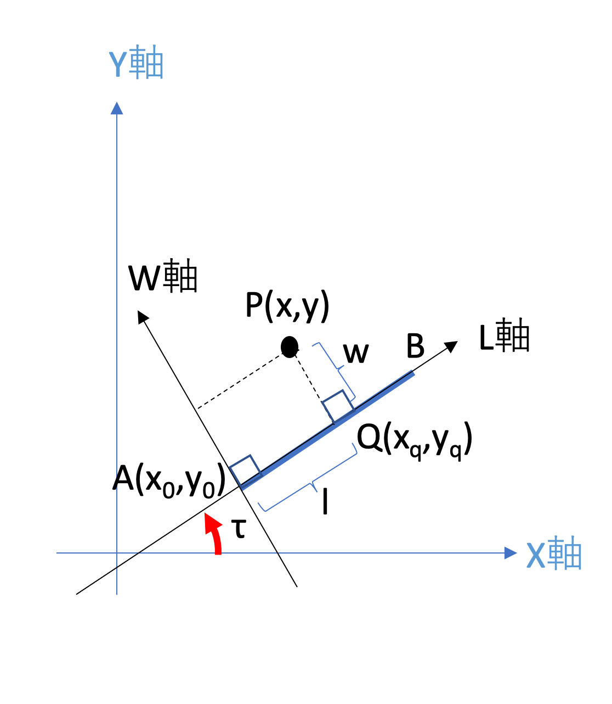

---
puppeteer:
    displayHeaderFooter: true
    headerTemplate: '
, 
'
    footerTemplate: '
 /
'
---

# 割り出し

割り出しとは、平面直角座標系上の点 $P(x, y)$を路線座標系の点$(l, w)$に変換する計算のことである。3 つの線形(線分、単曲線、クロソイド曲線)から構成される曲線である「路線」は、路線距離$l$の点$Q$で直線$QP$と直交する。この時の直線$QP$との位置を幅$w$で表現すると、点$(l, w)$は路線に沿って湾曲した座標系を構成する。

## 線分での割り出し

曲線長$L$の線分$AB$に対して、平面直角座標系上の点 $P(x, y)$から路線座標系上の点 $P(l, w)$への変換を考える。具体的には、軸$X$と線分$AB$ のなす角を$\tau$と置く。線分での割り出しを次の図で示す。

</img>

点$P(l, w)$の座標系として、線分$AB$の始点$A(x_0, y_0)$を原点とし、線分$AB$方向を軸$L$、始点$A$を通って点$P$の軸 $L$ に直交する軸$W$ を考える。これは元の座標系を始点 $A$ を原点として、方向角$\tau$だけ回転させたものと一致する。したがって、逆回転行列を$R^{-1}(\tau)$とすると 点 $P(l, w)$には次の式が成り立つ。

$$
\begin{pmatrix}
l \\
w
\end{pmatrix} =
R^{-1}(\tau)
\begin{pmatrix}
x - x_0\\
y - y_0
\end{pmatrix} =
\begin{pmatrix}
\cos\tau & \sin\tau\\
-\sin\tau & \cos\tau
\end{pmatrix}
\begin{pmatrix}
x - x_0\\
y - y_0
\end{pmatrix}
$$

この時、点$P$の軸 $L$ についての垂線は、線分 $AB$ 上で交わるとは限らない。交点が存在する条件は　$ 0 \le l \lt L = |\vec{AB}|$ である。

以上により、線分$AB$に対する割り出しは次の通りである。

$$
\begin{pmatrix}
l \\
w
\end{pmatrix} =
\begin{pmatrix}
(x - x_0)\cos\tau+(y - y_0)\sin\tau\\
-(x - x_0)\sin\tau+(y - y_0)\cos\tau
\end{pmatrix} \quad (0 \le l \lt L)
$$

## 単曲線での割り出し

線分の場合と同様に曲線長$L$である単曲線$AB$に対して、平面直角座標系上の点 $P(x, y)$から路線座標系上の点 $P(l, w)$への変換を考える。具体的には、単曲線$AB$は中心点$C(x_c,y_c)$で、半径 $ R $、単曲線の始点 $ A(x_a, y_a) $ に対する接線方向角を $\tau$、$\vec{CA}$と$\vec{CP}$との**符号付き角度を$\theta$と置く**。ここで、単曲線の場合の割り出し計算を次の図に示す。単曲線の場合、反時計回りと時計回りの 2 つの場合を考える必要がある。反時計回りの場合は、$R>0, \theta>0$ であり、時計回りの場合は、$　R<0, \theta < 0$となる

</img>

曲線距離$l$について、円弧$AQ$は半径$R$で角度$\theta$の円弧である。したがって、$l=R\theta$である。反時計回りの場合も、時計回りの場合も、$l$は正の値を取るので同じ式となる。ここで、一般的に 2 点を与えられた時の角度$\theta_{CA}$の定義式を示す。式中の分子の$\times$は外積演算、分母の$\cdot$は内積演算である。また、$\vec{e_X}$は軸 $X$ の方向ベクトルであるので、$\vec{e_X} = (1, 0)$である。

$$
 \tan\theta_{CA} = \dfrac{|\vec{e_X}|\cdot|\vec{CA}|\sin\theta_{CA}}{|\vec{e_X}|\cdot|\vec{CA}|\cos\theta_{CA}} = \dfrac{\vec{e_X} \times \vec{CA}}{ \vec{e_X}\cdot \vec{CA}} =
 \dfrac{1\cdot(y_a-y_c) - 0\cdot(x_a-x_c)}{1\cdot(x_a-x_c)+0\cdot(y_a-y_c)} =
\dfrac{y_a-y_c}{x_a-x_c}
\\\\
\therefore \theta_{CA} = \arctan{\dfrac{y_a-y_c}{x_a-x_c}}
$$

これにより、符号付き角度$\theta$は、次のようになる。

$$
\theta = \theta_{CP} - \theta_{CA} = \arctan{\dfrac{y-y_c}{x-x_c}} - \arctan{\dfrac{y_a-y_c}{x_a-x_c}}
$$

さらなる条件として、直線$CP$は、単曲線$AB$と交わるとは限らない。交点$Q$が存在する条件は$0 \le |\theta| \lt \phi = L/|R|$である。

次に、幅$w$について、単曲線$AB$と直線$CP$の交点$Q$を原点とし、点$Q$の接線方向を軸$U$、軸 $U$ と直交する軸 $W$ を取る座標系を考える。これは元の座標系を交点$Q$を中心に角度$\tau + \theta$回転させた座標系である。軸$W$は交点$Q$の接線方向に対し左が正になるので、正負の向きに注意すると幅$w$は次の通りである。

$$
w = \begin{cases}
R  - |\vec{CP}|  & \text{if} & R \ge 0 \\
R  + |\vec{CP}|  & \text{if} & R < 0
\end{cases}
$$

以上により、単曲線の場合の割り出し計算式は次の通りである。

$$
\begin{array}{cll}
\begin{pmatrix}
l \\
w
\end{pmatrix} & =
\begin{pmatrix}
R\theta\\
R - sign(R)\sqrt{(x-x_c)^2+(y-y_c)^2}
\end{pmatrix}
\\
\\
\theta &= \arctan{\dfrac{y-y_c}{x-x_c}} - \arctan{\dfrac{y_a-y_c}{x_a-x_c}} \qquad  (0 \le |\theta| \lt L/|R|)
\end{array}
$$

## クロソイド曲線での割り出し

略。

## 補足

### 回転行列; 線形代数

回転行列$R(\theta)$は、ある点を角度$\theta$回転させる特殊な行列である。回転行列の逆行列を逆回転行列と呼ぶ。回転行列$R(\theta)$と逆回転行列$R^{-1}(\tau)$は次の通りである。

$$
R(\theta) =
\begin{pmatrix}
\cos\theta & -\sin\theta\\
\sin\theta & \cos\theta
\end{pmatrix}
\\
\\
R^{-1}(\tau) =
\begin{pmatrix}
\cos\tau & \sin\tau\\
-\sin\tau & \cos\tau
\end{pmatrix}
\\
\\
$$

逆回転行列には$R^{-1}(\tau)= R(-\tau)$という性質がある。$\theta$に$-\tau$を代入すると、逆回転行列となる。

$$
R(\theta)|_{\theta=-\tau} =
R(-\tau) =
\begin{pmatrix}
\cos(-\tau) & -\sin(-\tau)\\
\sin(-\tau) & \cos(-\tau)
\end{pmatrix} =
\begin{pmatrix}
\cos\tau & \sin\tau\\
-\sin\tau & \cos\tau
\end{pmatrix} =
R^{-1}(\tau)
$$

### 座標系の変換; 線形代数

ある座標系上の点$(x, y)$が$(x_0,y_0)$を原点として角度$\tau$回転させた新たな座標系上の点$(u, v)$に一致する時、次の式が成り立つ。

$$
\begin{pmatrix}
u \\
v
\end{pmatrix} =
R^{-1}(\tau)
\begin{pmatrix}
x - x_0\\
y - y_0
\end{pmatrix} =
\begin{pmatrix}
\cos\tau & \sin\tau\\
-\sin\tau & \cos\tau
\end{pmatrix}
\begin{pmatrix}
x - x_0\\
y - y_0
\end{pmatrix}
$$

-   **証明**

新たな座標系上の点を$(u, v)$とすると、角度$\tau$回転させ、$(x_0, y_0)$分、平行移動した先が元の座標$(x, y)$であるから、次の式が成り立つ。

$$
R(\tau)\begin{pmatrix}
u \\
v
\end{pmatrix} +
\begin{pmatrix}
x_0 \\
y_0
\end{pmatrix} =
\begin{pmatrix}
x \\
y
\end{pmatrix}
\\
\\
$$

$(x_0, y_0)$を移項して、逆回転行列を両辺にかける。

$$
\begin{array}{cl}
 (左辺) & = R^{-1}(\tau)R(\tau)\begin{pmatrix}
u \\
v
\end{pmatrix} =
\begin{pmatrix}
 1 & 0 \\
 0 & 1
 \end{pmatrix}
\begin{pmatrix}
u \\
v
\end{pmatrix} =
\begin{pmatrix}
u \\
v
\end{pmatrix}
\\\\
 (右辺) & = R^{-1}(\tau)
\begin{pmatrix}
x - x_0\\
y - y_0
\end{pmatrix} =
\begin{pmatrix}
\cos\tau & \sin\tau\\
-\sin\tau & \cos\tau
\end{pmatrix}
\begin{pmatrix}
x - x_0\\
y - y_0
\end{pmatrix}
\\\\
\therefore \begin{pmatrix}
u \\
v
\end{pmatrix}
& = \begin{pmatrix}
(x - x_0)\cos\tau+(y - y_0)\sin\tau \\
-(x - x_0)\sin\tau +(y - y_0)\cos\tau
\end{pmatrix}
\end{array}
$$

### 射影ベクトル; 数 II

</img>

ベクトル$\vec{AP} = (x-x_0, y-y_0)$ が、軸$L$上に射影されたベクトルを$\vec{AQ}$、軸$W$上に射影されたベクトルを$\vec{QP}$とする。軸$L$の方向ベクトルは$\vec{e_L}=(\cos\tau, \sin\tau)$、軸$W$の方向ベクトルは$\vec{e_W}=(-\sin\tau, \cos\tau)$である。これらは方向ベクトルなので、大きさは 1 である。$|\vec{e_L}|=|\vec{e_W}|=1$。したがって、

$$
\vec{AQ} = \dfrac{\vec{AP}\cdot\vec{e_L}}{|\vec{e_L}|^2} \vec{e_L} = l\vec{e_L}
\\
\\
\therefore l = \frac{\vec{AP}\cdot\vec{e_L}}{1^2} = (x-x_0)\cos\tau + (y - y_0)\sin\tau \\
\vec{QP} = \dfrac{\vec{AP}\cdot\vec{e_W}}{|\vec{e_W}|^2} \vec{e_W} = w\vec{e_W}
\\
\\
\therefore w = \frac{\vec{AP}\cdot\vec{e_W}}{1^2} = -(x-x_0)\sin\tau + (y - y_0)\cos\tau
$$

-   **証明**

点$Q$は軸$L$上の点なので比例定数$l$とすると、$\vec{AQ} = l \vec{e_L}$となる。$\vec{AQ}$と$\vec{QP}$は直交するので、$\vec{AQ}\cdot\vec{QP} = 0$となる。$\vec{QP} = \vec{AP} - \vec{AQ}$ であるから、$\vec{QP}$を代入する。

$$
\begin{array}{cl}
 & \vec{AQ}\cdot\vec{QP} = \vec{AQ}\cdot(\vec{AP}-\vec{AQ})= 0
 \\
 \implies & l \vec{e_L} \cdot \vec{AP} - l \vec{e_L} \cdot l \vec{e_L} = 0\\
 \implies & l (\vec{e_L} \cdot \vec{AP} - l |\vec{e_L}|^2 ) = 0\\
 & \therefore l = \dfrac{\vec{AP}\cdot \vec{e_L}}{|\vec{e_L}|^2}
\end{array}
$$

軸$W$でも同様の計算で、$ w = \dfrac{\vec{AP}\cdot{\vec{e_W}}}{|\vec{e_W}|^2} $となる。

### 余弦定理

</img>
この図において、三角形$PAB$の角度を$\theta$とすると、余弦定理から、$|\vec{PB}|^2 = |\vec{AP}|^2 + |\vec{AB}|^2 -2 |\vec{AP}||\vec{AB}|\cos\theta$ が成り立つ。|$\vec{AP}|\cos\theta = l$であることに注意すると、次の式が成り立つ。

$$
\begin{cases}
  \vec{PB} = (|\vec{AB}|\cos\tau + x_0 - x, |\vec{AB}|\sin\tau + x_0 - x) \\
  \vec{AP} = (x - x_0, y - y_0) \\
  l = |\vec{AP}| \cos\theta
\end{cases}
$$

これらを余弦定理の式に代入する。

$$
\begin{array}{ll}
(左辺) & = (|\vec{AB}|\cos\tau -(x - x_0))^2 + (|\vec{AB}|\sin\tau - (y - y_0))^2 \\
 & = \cancel{|\vec{AB}|^2} -2|\vec{AB}|((x-x_0)\cos\tau + (y-y_0)\sin\tau)  + \cancel{(x-x_0)^2} +  \cancel{(y-y_0)^2} \\
 \\
 (右辺) & = |\vec{AP}|^2 + |\vec{AB}|^2 -2 |\vec{AP}||\vec{AB}|\cos\theta \\
   & = \cancel{(x-x_0)^2} + \cancel{(y - y_0)^2} + \cancel{|\vec{AB}|^2} -2|\vec{AB}|\cdot l \\
\\
\implies & 2|\vec{AB}|\cdot l = 2|\vec{AB}|((x-x_0)\cos\tau + (y-y_0)\sin\tau) \\
\end{array}
$$

したがって、$l = (x-x_0)\cos\tau + (y-y_0)\sin\tau$が成り立つ。

同様に、$W$軸上の点$Q_W$を考え、三角形$PAQ_W$での余弦定理を考える。$|\vec{PQ_W}|^2 = |\vec{AP}|^2 + |\vec{AQ_W}|^2 -2 |\vec{AP}||\vec{AQ_W}|\cos\theta_w$ である。

$$
\begin{array}{ll}
(左辺) & = (|\vec{AQ_W}|\cos(\tau+\pi/2) -(x - x_0))^2 + (|\vec{AQ_W}|\sin(\tau+\pi/2) - (y - y_0))^2 \\
 & = \cancel{|\vec{AQ_W}|^2} -2|\vec{AQ_W}|(-(x-x_0)\sin\tau + (y-y_0)\cos\tau)  + \cancel{(x-x_0)^2} +  \cancel{(y-y_0)^2} \\
 \\
 (右辺) & = |\vec{AP}|^2 + |\vec{AQ_W}|^2 -2 |\vec{AP}||\vec{AQ_W}|\cos\theta_w \\
   & = \cancel{(x-x_0)^2} + \cancel{(y - y_0)^2} + \cancel{|\vec{AQ_W}|^2} -2|\vec{AQ_W}|\cdot w \\
\\
\implies & 2|\vec{AQ_W}|\cdot w = 2|\vec{AQ_W}|(-(x-x_0)\sin\tau + (y-y_0)\cos\tau)
\end{array}
$$

したがって、他の場合ど同様に、$ w= -(x-x_0)\sin\tau + (y-y_0)\cos\tau$が成り立つ。

$$
\therefore \begin{pmatrix}
l \\
w
\end{pmatrix}
= \begin{pmatrix}
(x - x_0)\cos\tau+(y - y_0)\sin\tau \\
-(x - x_0)\sin\tau +(y - y_0)\cos\tau
\end{pmatrix}
$$

### $sign$関数

$$
sign(x) = \begin{cases}
1 & \text{if} & x > 0 \\
0 & \text{if} & x = 0 \\
-1 & \text{if} & x < 0 \\
\end{cases}
$$

### 方向角$\theta$

任意の 2 点$CA$を与えられた時の符号付き角度$\theta_{CA}$は次の式であった。

$$
 \theta_{CA} = \arctan\dfrac{y_a-y_c}{x_a-x_c}
$$

ただし、$arctan$ 関数の値域は$-\pi < \theta_{CA} \le \pi $ なので、軸$X$を基準とした**方向角$\theta$は** $ 0 \le \theta < 2\pi $ であるので、$\theta$を得るには $\theta_{CA}$ が負の時だけ$+2\pi$分、この値を補正する必要がある。これは、sign 関数を使って次の通りとなる。

$$
  \theta = \theta_{CA} + (1 - sign(\theta_{CA}) |sign(\theta_{CA})|\pi
$$

したがって、次の表により、方向角 $\theta$が成り立つことがわかる。
|条件|$sign(\theta_{CA})$|$1-sign(\theta_{CA})$|$\|sign(\theta_{CA})\|$| $\theta$|
|:-:|:-:|:-:|:-:|:-:|
|$\theta_{CA}>0$|1|0|1| $\theta_{CA}$|
|$\theta_{CA}=0$|0|1|0| $\theta_{CA}$|
|$\theta_{CA}<0$|-1|2|1| $\theta_{CA} + 2\pi$|

# 路線における割り出し計算

## 複数の線形に一致する割り出し

路線は 3 種類の線形要素の組み合わせである。そこで、任意の点$P(x,y)$が、路線中のどの線形要素上に対応するのか、探索する必要がある。素朴な線形探索では、路線の終端に近い領域ほど計時時間を必要とする実装になる。

一つのアイデアとして、各線形の始点と求めたい点$P$との距離を計算しておき、最短距離となる始点を求める。始点は前後二つの線形の端点なので、その二つの線形に限って割り出し計算すると効率が良いはずである。この場合の計算量は $O(n)$である。これより速くするなら**最近傍探索**用のデータ構造を導入する必要がある。
