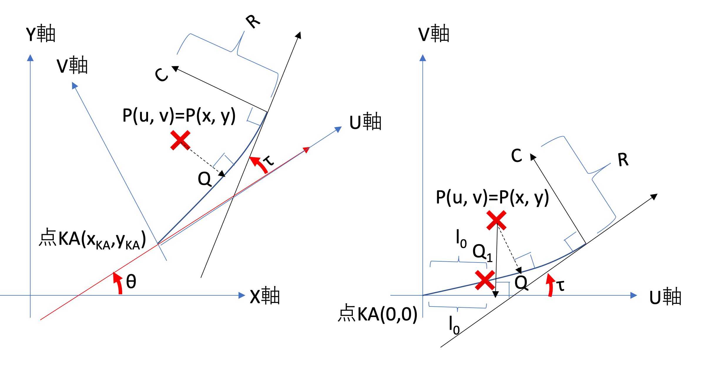
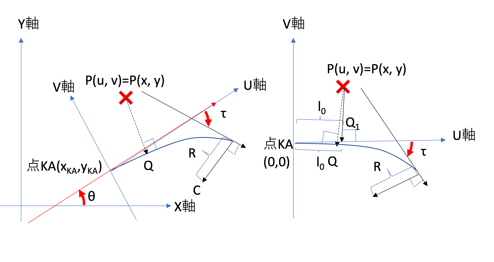

---
ebook:
    authors: 秦野克彦
    title: 割り出し計算
puppeteer:
    displayHeaderFooter: true
    headerTemplate: '
, 
'
    footerTemplate: '
 /
'
---  
  
  

  

  
<!-- @import "[TOC]" {cmd="toc" depthFrom=1 depthTo=6 orderedList=false} -->
  
<!-- code_chunk_output -->
  
-   [割り出し](#割り出し )
    -   [線分での割り出し](#線分での割り出し )
    -   [単曲線での割り出し](#単曲線での割り出し )
    -   [クロソイド曲線での割り出し](#クロソイド曲線での割り出し )
        -   [クロソイド](#ka-keクロソイドr-0 )
        -   [クロソイド](#ka-keクロソイドr-0-1 )
        -   [クロソイド](#ka-keクロソイド )
        -   [クロソイド](#ke-kaクロソイドr0 )
        -   [クロソイド](#ke-kaクロソイドr0-1 )
        -   [クロソイド](#ke-ka-クロソイド )
        -   [卵形クロソイド](#卵形クロソイドkae-kee )
        -   [卵形クロソイド](#卵形クロソイドkee-kae )
        -   [クロソイド割り出し式一覧表](#クロソイド割り出し式一覧表 )
    -   [補足](#補足 )
        -   [回転行列; 線形代数](#回転行列-線形代数 )
        -   [座標系の変換; 線形代数](#座標系の変換-線形代数 )
        -   [射影ベクトル; 数 II](#射影ベクトル-数-ii )
        -   [余弦定理](#余弦定理 )
        -   [関数](#sign関数 )
        -   [方向角](#方向角theta )
-   [路線における割り出し計算](#路線における割り出し計算 )
    -   [複数の線形に一致する割り出し](#複数の線形に一致する割り出し )
  
<!-- /code_chunk_output -->

  

  

  
  
  
#  割り出し
  
  
割り出しとは、平面直角座標系上の点 を路線座標系の点に変換する計算のことである。3 つの線形(線分、単曲線、クロソイド曲線)から構成される曲線である「路線」は、路線距離の点で直線と直交する。この時の直線との位置を幅で表現すると、点は路線に沿って湾曲した座標系を構成する。
  
##  線分での割り出し
  
  
曲線長の線分に対して、平面直角座標系上の点 から路線座標系上の点 への変換を考える。具体的には、軸と線分 のなす角をと置く。線分での割り出しを次の図で示す。
  
</img>
  
点の座標系として、線分の始点を原点とし、線分方向を軸、始点を通って点の軸  に直交する軸 を考える。これは元の座標系を始点  を原点として、方向角だけ回転させたものと一致する。したがって、逆回転行列をとすると 点 には次の式が成り立つ。
  

  
  
  
この時、点の軸  についての垂線は、線分  上で交わるとは限らない。交点が存在する条件は　 である。
  
以上により、線分に対する割り出しは次の通りである。
  

  
  
  
交点  は次の通りである。
  

  
  
  
##  単曲線での割り出し
  
  
線分の場合と同様に曲線長である単曲線に対して、平面直角座標系上の点 から路線座標系上の点 への変換を考える。具体的には、単曲線は中心点で、半径 、単曲線の始点  に対する接線方向角を 、ととの**符号付き角度をと置く**。ここで、単曲線の場合の割り出し計算を次の図に示す。単曲線の場合、反時計回りと時計回りの 2 つの場合を考える必要がある。反時計回りの場合は、 であり、時計回りの場合は、となる
  
</img>
  
曲線距離について、円弧は半径で角度の円弧である。したがって、である。反時計回りの場合も、時計回りの場合も、は正の値を取るので同じ式となる。ここで、一般的に 2 点を与えられた時の角度の定義式を示す。式中の分子のは外積演算、分母のは内積演算である。また、は軸  の方向ベクトルであるので、である。
  

  
  
  
これにより、符号付き角度は、次のようになる。
  

  
  
  
さらなる条件として、直線は、単曲線と交わるとは限らない。交点が存在する条件はである。
  
次に、幅について、単曲線と直線の交点を原点とし、点の接線方向を軸、軸  と直交する軸  を取る座標系を考える。軸は交点の接線方向に対し左が正になるので、正負の向きに注意すると幅は次の通りである。
  

  
  
  
以上により、単曲線の場合の割り出し計算式は次の通りである。
  

  
  
  
この場合、単曲線と直線の交点の座標は、線分を点を中心に角度回転させた点となる。
  

  
  
  
##  クロソイド曲線での割り出し
  
  
これまで同様に曲線長であるクロソイド曲線に対して、平面直角座標系上の点 から路線座標系上の点 への変換を考える。具体的にクロソイド曲線は、始点 で接線方向角、終端  での半径 、クロソイドパラメータは  とする。ここで、求める点  のクロソイド曲線に対する垂線との交点  を求めるために、 を原点としクロソイド曲線の接線方向角を軸 、軸  と直交する軸  を設定する。これらを説明する図を次に示す。なお、反時計回りの場合は、 であり、時計回りの場合は、である。
  
###  クロソイド
  
  
まず、原座標系を下左図で、変換後の小座標系を下右図に示す。下右図は、 を原点としクロソイド曲線の接線方向角を軸 、軸  と直交する軸  とする座標系である。
  
</img>
  
この小座標系への変換は次の通りである。
  

  
  
  
以降は全てこの小座標系で議論する。
  
求める点  に対するクロソイド上の点  が接線方向角を持つ時、点 を原点として接線方向を軸とする座標変換を考える。まず、クロソイド曲線の始点  を とする。ここで、 であり、接線方向角 、クロソイド長  である。この座標系で求める点 は次の通りになる。
  

  
  
  
次に、この  をクロソイド長とする点を考える。、、 である。この点 を原点とする座標系で求める点 は次の通りになる。
  

  
  
  
次にをクロソイド長とする点を考える。、、 である。
  
これを続けていくととなり、点は求める点に収束する。計算上、十分  に近い値となるのがである時、求める点 が次のように定まる。ここで、この点がクロソイド曲線上に存在するためには、 でなければならない。
  

  
  
  
###  クロソイド
  
  
まず、原座標系を下左図で、変換後の小座標系を下右図に示す。下右図は、 を原点としクロソイド曲線の接線方向角を軸 、軸  と直交する軸  とする座標系である。
  
</img>
  
この小座標系への変換は次の通りである。これは、の場合と同じである。
  

  
  
  
以降は全てこの小座標系で議論する。
  
求める点  に対するクロソイド上の点  が接線方向角を持つ時、点 を原点として接線方向を軸とする座標変換を考える。まず、クロソイド曲線の始点  を とする。ここで、 であり、接線方向角 、クロソイド長  である。この座標系で求める点 は次の通りになる。
  

  
  
  
次に、この  をクロソイド長とする点を考える。、、 である。この点 を原点とする座標系で求める点 は次の通りになる。
  

  
  
  
次にをクロソイド長とする点を考える。、、 である。
  
これを続けていくととなり、点は求める点に収束する。計算上、十分  に近い値となるのがである時、求める点 が次のように定まる。ここで、この点がクロソイド曲線上に存在するためには、 でなければならない。
  

  
  
  
###  クロソイド
  
  
以上、 クロソイドの割り出し計算式は以下の通りまとめることができる。
  

  
  
  
###  クロソイド
  
  
 クロソイドの場合も同様に、 を原点としクロソイド曲線の接線方向角と逆向きを軸 、軸  と直交する軸  とする座標系を取る。この小座標系への変換は次の通りである。
  

  
  
  
ここで、点 は次の方程式を満たす。
  

  
  
  
 クロソイド は点が始点であるから、点の式を代入して点の式にする。
  

  
  
  
以降はこの小座標系で議論する。この小座標系は、クロソイドのの形状を原点を中心に 180 度回転させものと一致する。したがって、求める点  に対するクロソイド上の点  に至るまで、次の同じ式が成り立つ。ここで、 であり、接線方向角 、クロソイド長  である。
  

  
  
  
点は求める点に収束する。計算上、十分  に近い値となるのがである時、求める点 が次のように定まる。は、点からの曲線長なので、曲線長 に累積曲線長 を加えることになる。ここで、この点がクロソイド曲線上に存在するためには、 でなければならない。
  

  
  
  
###  クロソイド
  
  
前節同同様に、点 を原点としクロソイド曲線の接線方向角を軸 、軸  と直交する軸  とする座標系であるぜこの小座標系への変換は次の通りである。
  

  
  
  
ここで、点 は次の方程式を満たす。
  

  
  
  
 クロソイド は点が始点であるから、点の式を代入して点の式にする。
  

  
  
  
以降はこの小座標系で議論する。この小座標系は、クロソイドのの形状と一致する。したがって、求める点  に対するクロソイド上の点  に至るまで、次の同じ式が成り立つ。ここで、 であり、接線方向角 、クロソイド長  である。
  

  
  
  
点は求める点に収束する。計算上、十分  に近い値となるのがである時、求める点 が次のように定まる。は、点からの曲線長なので、曲線長 に累積曲線長 を加えることになる。ここで、この点がクロソイド曲線上に存在するためには、 でなければならない。
  

  
  
  
###  クロソイド
  
  
以上、 クロソイドの割り出し計算式は以下の通りまとめることができる。 の時、次の通りである。
  

  
  
  
 の時、次の通りである。
  

  
  
  
まず、への変換の逆行列について、 の時、の絶対値を外すと、であり、への変換式は の場合と同じである。
  

  
  
  
次に、の符号の違いを吸収するためには、とすればよい。
  
まとめると、 クロソイドの場合は、次の通りとなる。
  

  
  
  
###  卵形クロソイド
  
  
クロソイドパラメータを  とする卵形クロソイドは、基本クロソイド の の間に始点  を持ち、終端  は終点 と一致する。今、この点  での半径を 、終点  での半径を  として()、 点  を求める。この点  または点  を所与の点として点  が分かれば、前節までの基本クロソイドの式を全て再利用して割り出し計算を実施できる。ただし、交点  の存在する条件は、 である。ここでは点のクロソイド曲線長()である。
  
 である卵形クロソイドの点での接線方向角を、卵形クロソイドを包含する基本クロソイドとしての接線方向角とする。この角度での基本クロソイドとしての座標をとする。すると、原座標での点は次の方程式を満たす。
  

  
  
  
これを点について解くと、
  

  
  
  
同様に、 の時、
  

  
  
  
となる。どちらも次の値を使う。
  

  
  
  
ここで、次の式に置き換えると式を共通化できる。
  

  
  
  
さらに クロソイドは、点が始点であるから式をまとめると次の通りとなる。
  

  
  
  
まとめると、 卵形クロソイドの場合次の式が成り立つ
  

  
  
  
###  卵形クロソイド
  
  
クロソイドの場合を原則そのまま利用できる。
  

  
  
  
### 　　クロソイド割り出し式一覧表
  
  
|       式番号        |                     KA-KE                     |                                            KAE-KEE                                            |                                    KE-KA                                     |                                   KEE-KAE                                    |
| :-----------------: | :-------------------------------------------: | :-------------------------------------------------------------------------------------------: | :--------------------------------------------------------------------------: | :--------------------------------------------------------------------------: |
|      |  |          |  |  |
|                 |                       0                       |                                                                         |                                      0                                       |                                                   |
|               |                       0                       |                                                                             |                                                              |                                                        |
|             |                       0                       |                                                                           |                                                          |                                                          |
|             |                       0                       |                                                                  |                                                  |                                                |
|  |                       >                       |                                               >                                               |                                      >                                       |                                              |
|             |                       >                       |                                               >                                               |                                      >                                       |                                               |
|                |                         |                                                                         |                                                       |                                                       |
|                |                  |                                                                |                                                |                                              |
|                  |                              |                                                                         |                                                           |                                                        |
|                  |                       >                       |                                               >                                               |                                      >                                       |                                                                         |
|  |                       >                       |  |                                      >                                       |    |
  
##  補足
  
  
###  回転行列; 線形代数
  
  
回転行列は、ある点を角度回転させる特殊な行列である。回転行列の逆行列を逆回転行列と呼ぶ。回転行列と逆回転行列は次の通りである。
  

  
  
  
逆回転行列にはという性質がある。にを代入すると、逆回転行列となる。
  

  
  
  
###  座標系の変換; 線形代数
  
  
ある座標系上の点がを原点として角度回転させた新たな座標系上の点に一致する時、次の式が成り立つ。
  

  
  
  
-   **証明**
  
新たな座標系上の点をとすると、角度回転させ、分、平行移動した先が元の座標であるから、次の式が成り立つ。
  

  
  
  
を移項して、逆回転行列を両辺にかける。
  

  
  
  
###  射影ベクトル; 数 II
  
  
</img>
  
ベクトル が、軸上に射影されたベクトルを、軸上に射影されたベクトルをとする。軸の方向ベクトルは、軸の方向ベクトルはである。これらは方向ベクトルなので、大きさは 1 である。。したがって、
  

  
  
  
-   **証明**
  
点は軸上の点なので比例定数とすると、となる。とは直交するので、となる。 であるから、を代入する。
  

  
  
  
軸でも同様の計算で、となる。
  
###  余弦定理
  
  
</img>
この図において、三角形の角度をとすると、余弦定理から、 が成り立つ。|であることに注意すると、次の式が成り立つ。
  

  
  
  
これらを余弦定理の式に代入する。
  

  
  
  
したがって、が成り立つ。
  
同様に、軸上の点を考え、三角形での余弦定理を考える。 である。
  

  
  
  
したがって、他の場合ど同様に、が成り立つ。
  

  
  
  
###  関数
  
  

  
  
  
###  方向角
  
  
任意の 2 点を与えられた時の符号付き角度は次の式であった。
  

  
  
  
ただし、 関数の値域は なので、軸を基準とした**方向角は**  であるので、を得るには  が負の時だけ分、この値を補正する必要がある。これは、sign 関数を使って次の通りとなる。
  

  
  
  
したがって、次の表により、方向角 が成り立つことがわかる。
|条件|||| |
|:-:|:-:|:-:|:-:|:-:|
||1|0|1| |
||0|1|0| |
||-1|2|1| |
  
#  路線における割り出し計算
  
  
##  複数の線形に一致する割り出し
  
  
路線は 3 種類の線形要素の組み合わせである。そこで、任意の点が、路線中のどの線形要素上に対応するのか、探索する必要がある。素朴な線形探索では、路線の終端に近い領域ほど計時時間を必要とする実装になる。
  
一つのアイデアとして、各線形の始点と求めたい点との距離を計算しておき、最短距離となる始点を求める。始点は前後二つの線形の端点なので、その二つの線形に限って割り出し計算すると効率が良いはずである。この場合の計算量は である。これより速くするなら**最近傍探索**用のデータ構造を導入する必要がある。
  

  
  
  